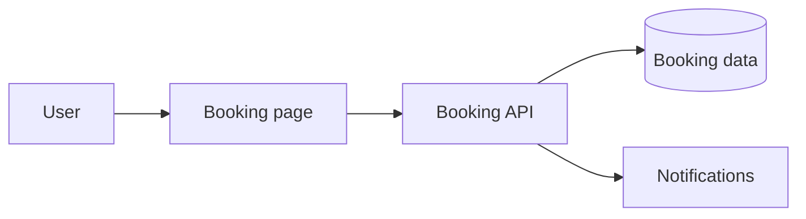

# Software Development: Equipment Booking Service

> A fictional web service for small teams.

## Purpose

Share room and equipment availability to reduce double bookings.

## Architecture notes

## Initial release scope

- Show equipment and availability.
- Create, change, and cancel bookings.
- Send confirmation notifications to the person who booked.

## Related specifications

- [Booking API Specification](Booking API Specification.md)
- [Incident and Issue Notes](Incident and Issue Notes.md)
