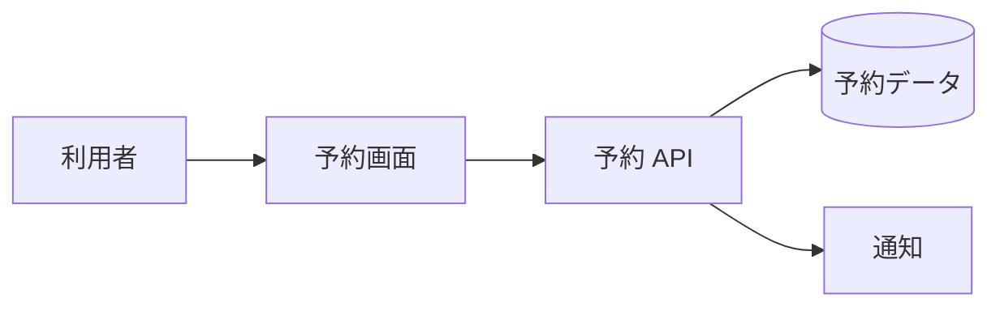

# ソフトウェア開発：備品予約サービス

> 小規模チーム向けの架空の Web サービスです。

## 目的

会議室や撮影機材の予約状況を共有し、二重予約を減らす。

## 構成メモ

## 初期リリースの範囲

- 備品一覧と空き状況の表示
- 予約の作成、変更、キャンセル
- 予約者への確認通知

## 仕様へのリンク

- [予約 API 仕様](予約API仕様.md)
- [障害・課題メモ](障害課題メモ.md)

#ソフトウェア開発 #サービス設計
